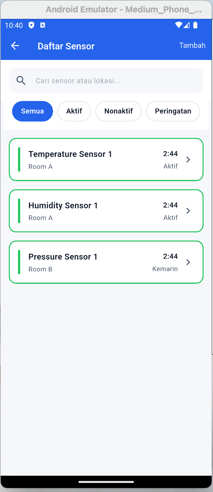
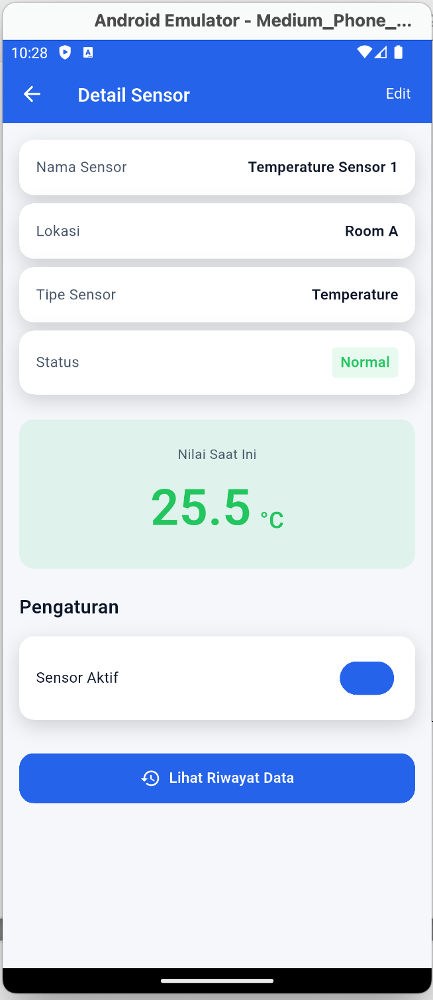
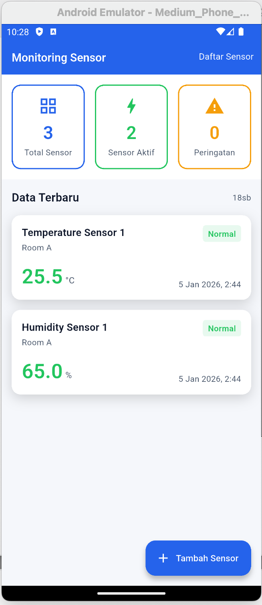
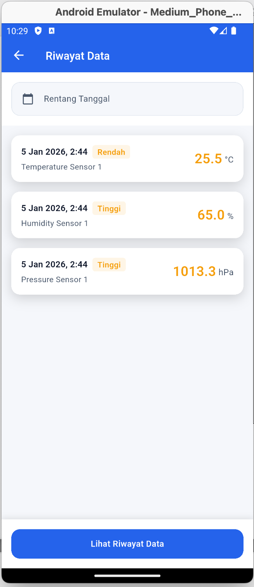
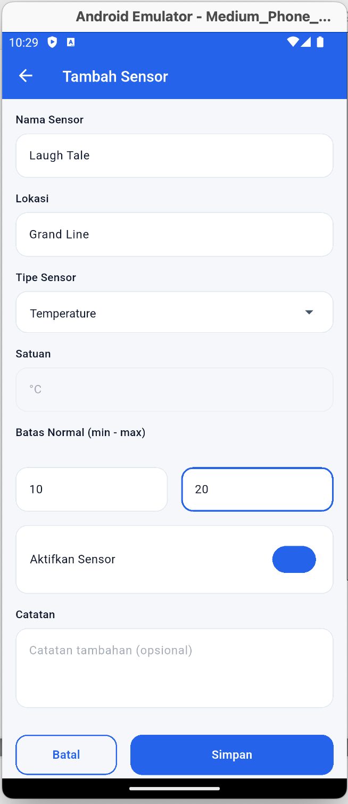

Sensor Monitoring App

adalah aplikasi Flutter + Supabase untuk mengelola, memantau, dan melihat riwayat data sensor seperti suhu, kelembapan, tekanan, dll.

Fitur Utama
Manajemen sensor (CRUD)
Monitoring nilai sensor
Riwayat data sensor
Status sensor (Aktif / Nonaktif)
Integrasi Supabase (PostgreSQL)

Tampilan Aplikasi

Daftar Sensor

Menampilkan seluruh sensor yang terdaftar.

Detail Sensor

Menampilkan informasi lengkap sensor & statusnya.

Monitor 

Monitoring nilai sensor secara real-time.

Riwayat Data

Menampilkan histori data sensor berdasarkan waktu.

Tambah Sensor

Form untuk menambahkan sensor baru.

